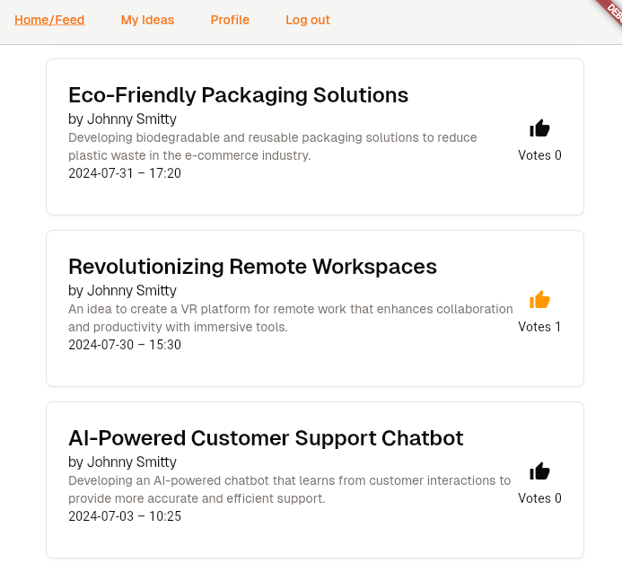

# **User Feedback Application**

An example feedback application built with Dart Serverpod, Flutter, and SQLite, designed to streamline user feedback collection and analysis.



## **Table of Contents**

1. [Features](#features)
2. [Technologies Used](#technologies-used)
3. [Getting Started](#getting-started)
4. [Installation](#installation)
5. [Configuration](#configuration)
6. [Usage](#usage)
7. [Database Schema](#database-schema)
8. [Endpoints](#endpoints)


## **Features**

- **User Registration and Login**: Secure user registration and authentication with email validation.
- **Account Activation**: Email-based activation with secure activation codes.
- **Feedback Submission**: Users can submit ideas and suggestions to improve services or products.
- **Voting System**: Users can upvote or downvote ideas, promoting community-driven feedback.
- **Comments**: Engage with feedback through comments. // Still not added

## **Technologies Used**

- **Frontend**: Flutter
- **Backend**: Dart Serverpod
- **Database**: SQLite
- **Email Service**: Gmail SMTP
- **Authentication**: JWT Token used togheter with the Dart Serverpod Auth custom overrides.

## **Getting Started**

Follow these instructions to set up and run the project on your local machine.

### **Prerequisites**

- [Flutter](https://flutter.dev/docs/get-started/install) installed
- Dart SDK installed
- SQLite installed

## **Installation**

1. **Clone the Repository**
   ```bash
   git clone https://github.com/Thrauk/feedback_ideas_app
   cd feedback-app
   ```

2. **Install Dependencies**
   ```bash
   flutter pub get
   ```

3. **Set up the Backend**
   Navigate to the server directory and install Serverpod dependencies:
   ```bash
   dart pub get
   ```

## **Configuration**

1. **Environment Variables**:
   Configure your `.env` file as seen in the template file:
   ```env
    # THE JWT SECRET USED TO GENERATE THE TOKEN. 
    JWT_SECRET=yourJWTSecret

    # SMTP DATA
    SMTP_EMAIL=youremail@domain.com
    SMTP_PASSWORD=passwordUsedForSMTP
   ```

2. **Email Settings**:
   If you want to use a Gmail address to send out the activation emails ensure that your account account allows access for less secure apps or set up an App Password. Follow these instructions: https://support.google.com/mail/answer/185833?hl=en

## **Usage**

1. **Run the Backend Server**:
   ```bash
   cd feedback_ideas_app_server
   dart bin/main.dart
   ```

2. **Run the Flutter App**:
   ```bash
   cd feedback_ideas_app_flutter
   flutter run
   ```


## **Database Schema**

### **Users Table**
| Column        | Type    | Description                  |
|---------------|---------|------------------------------|
| `id`          | INTEGER | Primary key                  |
| `uuid`        | TEXT    | Unique identifier            |
| `email`       | TEXT    | User email (unique)          |
| `password`    | TEXT    | Hashed password              |
| `firstName`   | TEXT    | User's first name            |
| `lastName`    | TEXT    | User's last name             |
| `isActivated` | INTEGER | Account activation status    |

### **ActivationCodes Table**
| Column         | Type    | Description                    |
|----------------|---------|--------------------------------|
| `id`           | INTEGER | Primary key                    |
| `userUuid`     | TEXT    | User's unique identifier       |
| `activationCode` | TEXT  | Activation code                |
| `expiryDate`   | DATETIME| Expiry date of the code        |
| `isUsed`       | INTEGER | Code usage status              |

### **Ideas Table**
| Column         | Type     | Description                   |
|----------------|----------|-------------------------------|
| `id`           | INTEGER  | Primary key                   |
| `uuid`         | TEXT     | Unique idea identifier        |
| `postedAt`     | DATETIME | Date and time of posting      |
| `title`        | TEXT     | Title of the idea             |
| `content`      | TEXT     | Content of the idea           |
| `authorUuid`   | TEXT     | Author's user UUID            |
| `votesNumber`  | INTEGER  | Number of votes               |
| `commentsNumber` | INTEGER | Number of comments           |

### **IdeaVotes Table**
| Column        | Type     | Description                   |
|---------------|----------|-------------------------------|
| `id`          | INTEGER  | Primary key                   |
| `userUuid`    | TEXT     | UUID of the voting user       |
| `ideaUuid`    | TEXT     | UUID of the voted idea        |
| `votedAt`     | DATETIME | Date and time of the vote     |

## **Endpoints**

### **UserEndpoint**

1. **`POST /register`**  
   Registers a new user and sends an activation email.
   
   Parameters:
   - `email`: String
   - `password`: String
   - `firstName`: String
   - `lastName`: String

2. **`POST /login`**  
   Logs in the user and returns a JWT token.

   Parameters:
   - `email`: String
   - `password`: String

3. **`POST /activateAccount`**  
   Activates a user account using an activation code.

   Parameters:
   - `activationCode`: String

### **IdeaEndpoint**

1. **`POST /postIdea`**  
   Allows a logged-in user to post an idea.

   Parameters:
   - `title`: String
   - `content`: String

2. **`POST /voteIdea`**  
   Allows a logged-in user to vote on an idea.

   Parameters:
   - `ideaUuid`: String

3. **`POST /removeVote`**  
   Allows a logged-in user to remove their vote from an idea.

   Parameters:
   - `ideaUuid`: String

4. **`GET /getLoggedUserIdeas`**  
   Retrieves ideas posted by the logged-in user.

5. **`GET /getIdeas`**  
   Retrieves all ideas, sorted based on user preferences.

   Parameters:
   - `sortBy`: String (default: 'postedAt')
   - `sortOrder`: int (0 = ascending, 1 = descending)
